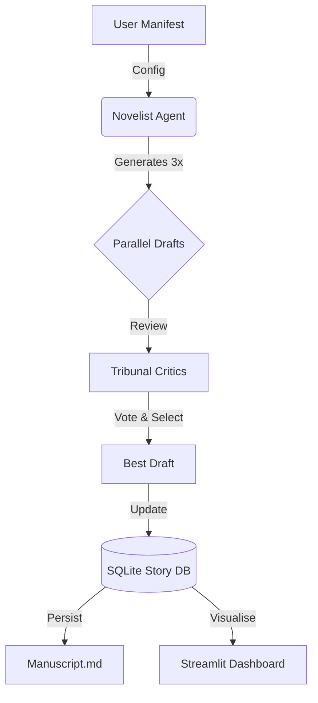

# ✒️ Novelist Agent (Alpha)

> **Create immersive fiction with an AI that remembers.**


**Novelist** is an agentic writing system designed for long-form fiction. Unlike chatty assistants that forget details after a few pages, Novelist uses a dedicated **Database Memory** and a **Parallel Critic Tribunal** to maintain consistency, tone, and plot threads across tens of thousands of words.

⚠️ **Alpha Software**: This project is in active development. Expect API changes, experimental features, and the occasional hallucination.

---

## ✨ Key Features

### 🧠 Deep Context Memory

- **SQLite Backend**: Migrated from fragile JSON files to a robust SQL database (`story.db`).
- **Entity Tracking**: Automatically updates the "World State" (Time, Location, Inventory) and "Character Bible" (Relationships, Hidden Agendas).
- **Arc Ledger**: Tracks unresolved plot threads, promises to the reader, and thematic resonance.

### ⚡ Parallel Drafting Engine

- **"Best of 3" Generation**: The agent drafts three variations of every scene simultaneously.
- **Agentic Tribunal**: Three distinct Critic Agents (Prose, Redundancy, Arc) vote on the best draft.
- **Self-Correction**: The system automatically fixes common AI tics (purple prose, repetition) before you ever see the text.

### 📊 Writer's Dashboard

- **Real-Time Monitoring**: Watch your story grow with a Streamlit-based dashboard.
- **Structure Visualization**: Track word counts, arc progression, and character status visually.
- **Project Management**: Create and switch between multiple story projects seamlessly.

---

## 🚀 Getting Started

### Prerequisites

- **Python 3.10+**
- **LLM backend** (Choose one):
  - **Local (Ollama):** Free, private. Requires [Ollama](https://ollama.ai) installed locally.
  - **Cloud (BYOK):** Fast, powerful. Requires an API Key (OpenAI, Groq, Together, etc.).

### Installation

1. **Clone the Repository**

   ```bash
   git clone https://github.com/AxolDad/novelist.git
   cd novelist
   ```

2. **Setup Environment (BYOK)**
   Create a `.env` file in the root directory. Choose your path:

   **Option A: Local Power (Ollama)**

   ```env
   LLM_PROVIDER=ollama
   OLLAMA_HOST=http://localhost:11434
   WRITER_MODEL=mistral
   CRITIC_MODEL=mistral
   ```

   **Option B: Cloud Speed (OpenAI / Comparable)**

   ```env
   LLM_PROVIDER=openai
   OPENAI_API_KEY=sk-your-key-here
   WRITER_MODEL=gpt-4o
   CRITIC_MODEL=gpt-4o-mini
   # Optional: Custom Base URL for Groq/Together
   # OPENAI_BASE_URL=https://api.groq.com/openai/v1
   ```

3. **Install Dependencies**
   ```bash
   pip install -r requirements.txt
   ```

---

## 🏎️ Usage

### 1. Launch the System (Recommended)

Double-click `start.bat` on Windows to launch both the Dashboard and the Agent.

### 2. Manual Launch

**Start the Dashboard:**

```bash
streamlit run dashboard.py
```

> Go to the **Home Tab** to create a new Story Project.
>
> **💡 Note: "Create Project" vs. "Story Title"**
>
> - **Create Project (Home Tab):** Creates a physical folder on your disk. Do this once to start a book. The name you choose here is the folder name.
> - **Story Title (Story Setup Tab):** Changes the _display title_ of your book in `story_manifest.json`. Use this to rename your book creatively without breaking file paths.

**Start the Agent:**

```bash
python novelist.py --project "projects/my_story_title"
```

> The agent will begin drafting scenes based on your Manifest.

---

## 🏗️ Architecture



## 🤝 Contributing

Contributions are welcome! Since we are in **Alpha**, please open an issue before submitting a PR for major architectural changes.

## 📄 License

MIT License. Build something beautiful.
